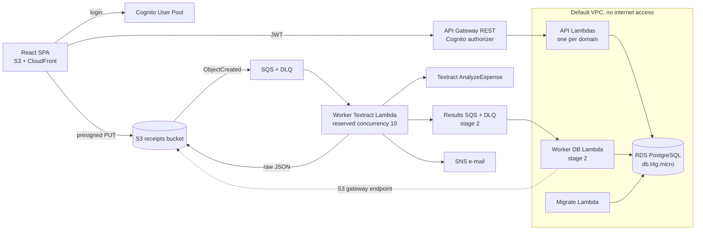

# Architecture

Serverless and event-driven on AWS (Learner Lab, `us-east-1`). The full reasoning is in the [proposal](project/kassenzettel.md), chapter 2. This page is the working summary; keep it in sync with `template.yaml`.

## Components

```mermaid
flowchart LR
  web[React SPA<br/>S3 + CloudFront] -->|JWT| api[API Gateway REST<br/>Cognito authorizer]
  web -->|login| cognito[Cognito User Pool]
  web -->|presigned PUT| s3[(S3 receipts bucket)]
  s3 -->|ObjectCreated| sqs[SQS + DLQ]
  subgraph vpc[Default VPC, no internet access]
    fns[API Lambdas<br/>one per domain]
    dbworker[Worker DB Lambda<br/>stage 2]
    migrate[Migrate Lambda]
    rds[(RDS PostgreSQL<br/>db.t4g.micro)]
    fns --> rds
    dbworker --> rds
    migrate --> rds
  end
  api --> fns
  sqs --> worker[Worker Textract Lambda<br/>reserved concurrency 10]
  worker --> textract[Textract AnalyzeExpense]
  worker -->|raw JSON| s3
  worker --> results[Results SQS + DLQ<br/>stage 2]
  results --> dbworker
  dbworker -.->|S3 gateway endpoint| s3
  worker --> sns[SNS e-mail]
```

| Component | Status | Owner |
|---|---|---|
| Cognito, API Gateway | scaffolded | @timonrieger, @nosernoel |
| RDS PostgreSQL, security groups, secrets, migration Lambda (`mise run db:migrate`) | scaffolded | @nosernoel |
| Households API (create, get) on PostgreSQL | scaffolded (reference pattern) | @nosernoel |
| S3 receipts bucket (lifecycle, S3 → SQS notification) | scaffolded | @timonrieger |
| Presigned upload endpoint (`createReceipt`, creates the `receipts` row) | scaffolded | @nosernoel |
| SQS + DLQ, worker Lambda | scaffolded (worker only logs) | @timonrieger, @Dam-Mil |
| Worker split: Textract Lambda outside the VPC, results queue, DB Lambda inside ([0007](decisions/0007-worker-split-and-db-credentials.md)) | planned (stage 2) | @timonrieger, @Dam-Mil |
| Worker logic: Textract, categorization, status | planned | @Dam-Mil |
| Receipt list and detail API (`ReceiptsFunction`) | contract only, routes answer 501 | @nosernoel |
| Reports API: monthly, trend (SQL `GROUP BY` at query time, `ReportsFunction`) | contract only, routes answer 501 | @nosernoel |
| SNS notifications | planned | @Dam-Mil |
| Account deletion queue + worker | planned | @Dam-Mil |
| S3 + CloudFront hosting | planned (prod stack only) | @timonrieger |
| CloudWatch alarms + dashboard | planned | @schmid277 |

Update the status column when something lands.

## Upload flow

1. Frontend asks the API for a presigned URL (`createReceipt`). The API inserts the receipt row (status `uploaded`) and puts its id in the S3 key: `households/<householdId>/receipts/<receiptId>` (built by `bonbon/receipts/storage.py`). The URL is signed locally, so the VPC Lambda needs no route to S3. Content type, size (max. 5 MB) and the tag `status=pending` are part of the signature.
2. Frontend uploads directly to S3 with a `PUT` and the returned `upload_headers`. The request ends there.
3. S3 event (keys under `households/`) → SQS → Textract Lambda, one message at a time, max 10 in parallel. It runs outside the VPC, calls Textract, stores the raw result in S3 outside `households/` (so it doesn't trigger itself) and sends the key to the results queue.
4. Results queue → DB Lambda inside the VPC. It switches status `uploaded → processing` with `UPDATE … WHERE status = 'uploaded'`, so a duplicate delivery is dropped, then categorizes items by keyword rules, writes receipt and items, sets `done`. The worker removes the `status=pending` tag from the file, so the lifecycle rule keeps it.
5. SNS notifies the user (from outside the VPC). The frontend polls the status.
6. After 3 failed attempts a message goes to the dead-letter queue of its queue.

Steps 3 and 4 are stage 2 ([0007](decisions/0007-worker-split-and-db-credentials.md)); today the worker only logs.

## Data model

PostgreSQL on RDS, database `bonbon`, schema in [`packages/api/src/bonbon/migrations/`](../packages/api/src/bonbon/migrations/) ([0006](decisions/0006-postgresql-on-rds.md)). Amounts are integers in Rappen. User ids are Cognito ids (`sub`); there is no users table.

| Table | Key | Notes | Status |
|---|---|---|---|
| `households` | `id` uuid | name, created_at | implemented |
| `memberships` | (`household_id`, `user_id`) | role `owner`/`member`; index on `user_id`; at most one owner per household | implemented |
| `invite_codes` | `code_hash` | household, `expires_at`, `used_at` | schema only |
| `receipts` | `id` uuid | uploaded_by, status `uploaded`/`processing`/`done`/`failed`/`duplicate`, file_hash, store, purchase_date, total_rappen; `file_hash` unique per household except for duplicates; index (`household_id`, `purchase_date`). The S3 key is derived from household and receipt id, the raw Textract result stays in S3 | schema only |
| `receipt_items` | (`receipt_id`, `position`) | name, quantity, unit and line amount, category (required) | schema only |
| `categories`, `category_rules` | `id` | keyword → category; `Sonstiges` exists for items no rule matches | schema only |
| `join_attempts` | `id` | rate limit for joining | schema only |
| `schema_migrations` | `version` | applied migration files | implemented |

Deleting a household cascades to memberships, invite codes and receipts; deleting a receipt cascades to its items. Monthly totals are computed with `GROUP BY` at query time, nothing is pre-aggregated.

## Security

- API Gateway checks the Cognito JWT on every route except CORS preflight.
- Every Lambda additionally checks household membership in the database (`require_membership`), so leaving a household takes effect immediately.
- Non-members get 404, not 403, so household ids can't be probed.
- Receipts live in a private, encrypted bucket and are reachable only via short-lived presigned URLs.
- The database is private (no public access), in the default VPC, and accepts port 5432 only from the Lambda security group. Connections use TLS with certificate verification.
- API and worker Lambdas connect as `bonbon_app` (data only, no schema changes); only the migration Lambda has the master user.
- Learner Lab limitation: all functions share the `LabRole`, so per-function least-privilege IAM isn't possible. This is documented as a known limitation.
- Learner Lab limitation: database passwords are passed to the VPC Lambdas as environment variables and are visible in their configuration, because Secrets Manager isn't reachable from the VPC without paid endpoints ([0007](decisions/0007-worker-split-and-db-credentials.md)).

## Environments

| Stack | Account | Deployed by | How |
|---|---|---|---|
| `bonbon-dev` | each person's own Learner Lab | that person | `mise run dev` / `mise run stack:up` |
| `bonbon-prod` | @timonrieger's Learner Lab | @timonrieger | `mise run deploy:prod` from `main` |

See [decisions/0004](decisions/0004-per-person-cloud-dev-stacks.md).
